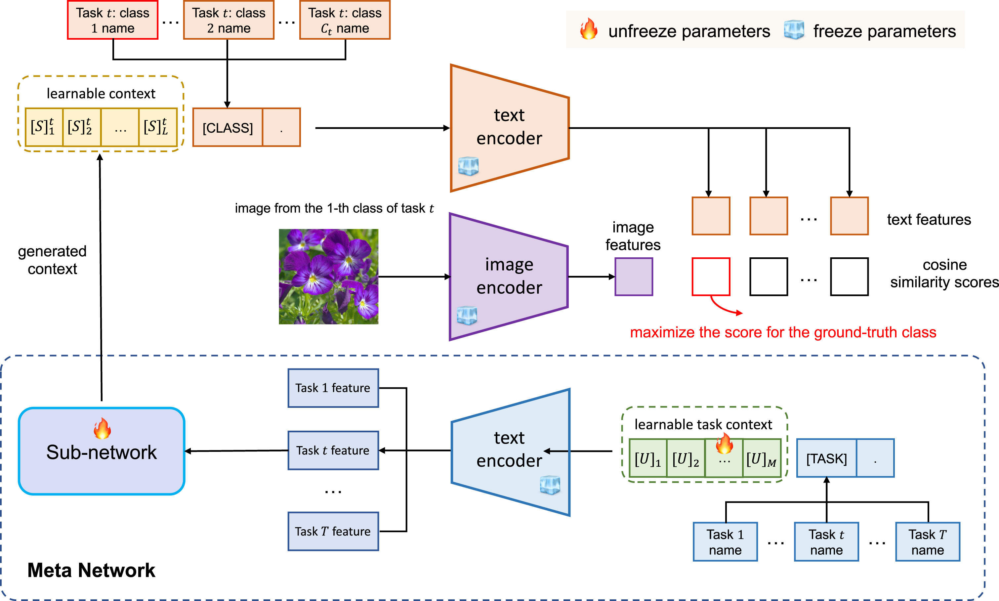
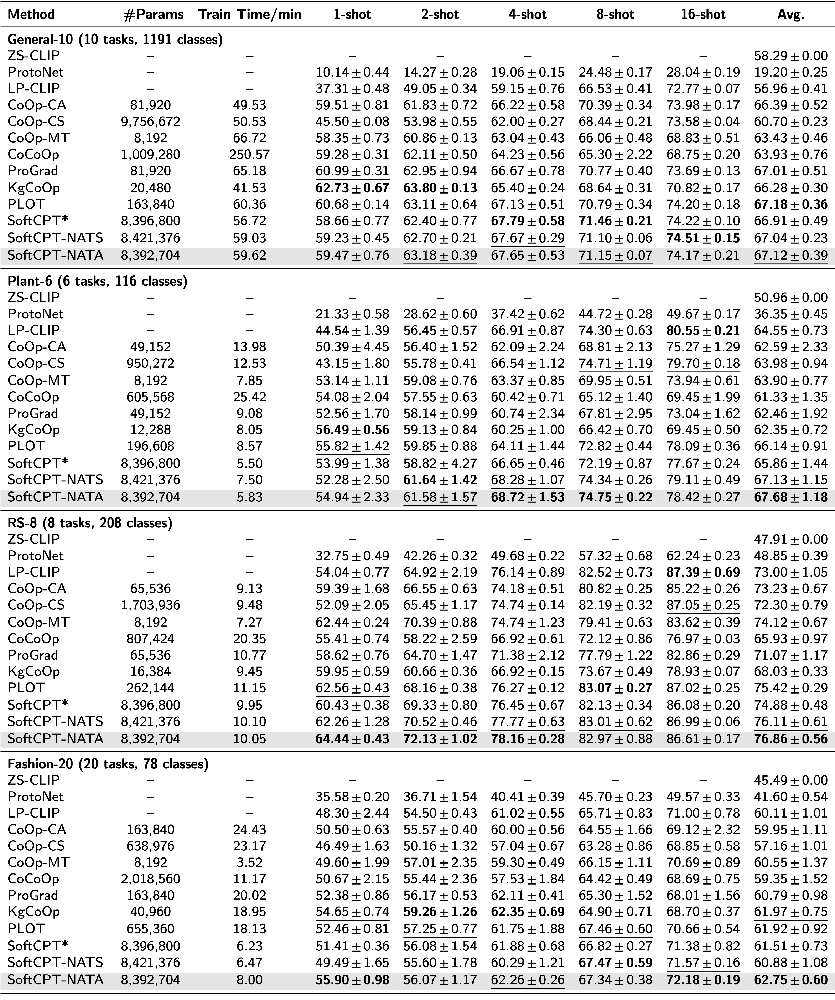

# [Prompt Tuning with Soft Context Sharing for Vision-Language Models](https://www.sciencedirect.com/science/article/abs/pii/S0925231224010610)

Vision–language models have recently shown great potential on many tasks in computer vision. Meanwhile, prior work demonstrates prompt tuning designed for vision–language models could acquire superior performance on few-shot image recognition compared to linear probe, a strong baseline. In practice, many few-shot tasks are inherently correlated, particularly within specialized domains. However, such information is overlooked previously. Inspired by the fact that modeling task relationship by multi-task learning can usually boost performance, we propose a novel method SoftCPT (Soft Context Sharing for Prompt Tuning) to tune pre-trained vision–language models on multiple target few-shot tasks jointly. Specifically, we design a task-shared meta network to generate prompt context for each task using task name together with a learnable task context as input. The parameters of this meta network as well as the task context are tuned on the joint training set of all tasks. As such, the prompt context of all tasks will be shared in a soft manner. Extensive experiments across four multi-task few-shot datasets covering 44 tasks and 1593 categories demonstrate that SoftCPT significantly outperforms single-task prompt tuning methods, highlighting the effectiveness of multi-task learning for vision–language prompt tuning.

<p align="center">
    
    
Unlike CoOp, a meta network is introduced to produce learnable context for each task. The meta network consists of a frozen text encoder and a learnable sub-network. The text encoder extracts task features from task names, while the sub-network transforms the task features to learnable context of class names. For model training, SoftCPT uses samples from all tasks and the loss is first computed independently for each task. The summed loss of all tasks is then used for backpropagation (ref. Eq. (8)). In the figure, [TASK] denotes token embeddings of task name, [CLASS] denotes token embeddings of a certain class name in a task.
</p>

## Installation
Our code is based on [CoOp](https://github.com/KaiyangZhou/CoOp), please refer to it for the installation.

## Datasets
Please refer to CoOp for downloading the datasets used in General-10. The datasets should be put into the subfolders according to the
`dataset_dir` class attribute in each dataset class. For downloading the datasets used in Plant-6, please refer to the link provided in
our original paper. The Fashion-20 dataset will be released soon.

## How to Run
Set environment variables in scripts/set_env.sh first.

### Multi-task Learning on All Classes

The navie hard sharing is implemented in trainers/mtcoop_hard.py, it also supports CoOp. The examples for use are listed below:

(1) hard shared CoOp, all classes of all tasks share a prompt
```commandline
sh main_mtcoop_hard.sh general10 rn50_ep50 1 16 False False
sh main_mtcoop_hard.sh general10 rn50_ep50 2 16 False False
sh main_mtcoop_hard.sh general10 rn50_ep50 4 16 False False
sh main_mtcoop_hard.sh general10 rn50_ep50 8 16 False False
sh main_mtcoop_hard.sh general10 rn50_ep50 16 16 False False
```

(2) CoOp, one prompt per task
```commandline
sh main_mtcoop_hard.sh general10 rn50_ep50 1 16 False True
sh main_mtcoop_hard.sh general10 rn50_ep50 2 16 False True
sh main_mtcoop_hard.sh general10 rn50_ep50 4 16 False True
sh main_mtcoop_hard.sh general10 rn50_ep50 8 16 False True
sh main_mtcoop_hard.sh general10 rn50_ep50 16 16 False True
```

(3) one prompt per class
```commandline
sh main_mtcoop_hard.sh general10 rn50_ep50 1 16 True False
sh main_mtcoop_hard.sh general10 rn50_ep50 2 16 True False
sh main_mtcoop_hard.sh general10 rn50_ep50 4 16 True False
sh main_mtcoop_hard.sh general10 rn50_ep50 8 16 True False
sh main_mtcoop_hard.sh general10 rn50_ep50 16 16 True False
```

Our soft sharing is implemented in trainers/mtcoop.py. The examples for use are listed below:

(1) SoftCPT-NATA
```commandline
sh main_mtcoop.sh general10 rn50_ep50 1 0 False 4 False 16 False lin 1
sh main_mtcoop.sh general10 rn50_ep50 2 0 False 4 False 16 False lin 1
sh main_mtcoop.sh general10 rn50_ep50 4 0 False 4 False 16 False lin 1
sh main_mtcoop.sh general10 rn50_ep50 8 0 False 4 False 16 False lin 1
sh main_mtcoop.sh general10 rn50_ep50 16 0 False 4 False 16 False lin 1
```

(2) SoftCPT-NATS
```commandline
sh main_mtcoop.sh general10 rn50_ep50 1 0 False 4 True 16 False lin 1
sh main_mtcoop.sh general10 rn50_ep50 2 0 False 4 True 16 False lin 1
sh main_mtcoop.sh general10 rn50_ep50 4 0 False 4 True 16 False lin 1
sh main_mtcoop.sh general10 rn50_ep50 8 0 False 4 True 16 False lin 1
sh main_mtcoop.sh general10 rn50_ep50 16 0 False 4 True 16 False lin 1
```

(3) SoftCPT-CATA

On General:
```commandline
sh main_mtcoop_cls_sample.sh general10 rn50_ep50 1 4 False 4 False 16 True lin 1 0.1
sh main_mtcoop_cls_sample.sh general10 rn50_ep50 2 4 False 4 False 16 True lin 1 0.1
sh main_mtcoop_cls_sample.sh general10 rn50_ep50 4 4 False 4 False 16 True lin 1 0.1
sh main_mtcoop_cls_sample.sh general10 rn50_ep50 8 4 False 4 False 16 True lin 1 0.1
sh main_mtcoop_cls_sample.sh general10 rn50_ep50 16 4 False 4 False 16 True lin 1 0.1
```

On Plant-6 and Fshion-20:
```commandline
sh main_mtcoop.sh plant6 rn50_ep50 1 4 False 4 False 16 True lin 1
sh main_mtcoop.sh plant6 rn50_ep50 2 4 False 4 False 16 True lin 1
sh main_mtcoop.sh plant6 rn50_ep50 4 4 False 4 False 16 True lin 1
sh main_mtcoop.sh plant6 rn50_ep50 8 4 False 4 False 16 True lin 1
sh main_mtcoop.sh plant6 rn50_ep50 16 4 False 4 False 16 True lin 1
```

(4) SoftCPT-CSTA

On General:
```commandline
sh main_mtcoop_cls_sample.sh general10 rn50_ep50 1 4 True 4 False 16 True lin 1 0.1
sh main_mtcoop_cls_sample.sh general10 rn50_ep50 2 4 True 4 False 16 True lin 1 0.1
sh main_mtcoop_cls_sample.sh general10 rn50_ep50 4 4 True 4 False 16 True lin 1 0.1
sh main_mtcoop_cls_sample.sh general10 rn50_ep50 8 4 True 4 False 16 True lin 1 0.1
sh main_mtcoop_cls_sample.sh general10 rn50_ep50 16 4 True 4 False 16 True lin 1 0.1
```

On Plant-6 and Fshion-20:
```commandline
sh main_mtcoop.sh plant6 rn50_ep50 1 4 True 4 False 16 True lin 1
sh main_mtcoop.sh plant6 rn50_ep50 2 4 True 4 False 16 True lin 1
sh main_mtcoop.sh plant6 rn50_ep50 4 4 True 4 False 16 True lin 1
sh main_mtcoop.sh plant6 rn50_ep50 8 4 True 4 False 16 True lin 1
sh main_mtcoop.sh plant6 rn50_ep50 16 4 True 4 False 16 True lin 1
```

(5) SoftCPT-CATS

On General:
```commandline
sh main_mtcoop_cls_sample.sh general10 rn50_ep50 1 4 False 4 True 16 True lin 1 0.1
sh main_mtcoop_cls_sample.sh general10 rn50_ep50 2 4 False 4 True 16 True lin 1 0.1
sh main_mtcoop_cls_sample.sh general10 rn50_ep50 4 4 False 4 True 16 True lin 1 0.1
sh main_mtcoop_cls_sample.sh general10 rn50_ep50 8 4 False 4 True 16 True lin 1 0.1
sh main_mtcoop_cls_sample.sh general10 rn50_ep50 16 4 False 4 True 16 True lin 1 0.1
```

On Plant-6 and Fshion-20:
```commandline
sh main_mtcoop.sh plant6 rn50_ep50 1 4 False 4 True 16 True lin 1
sh main_mtcoop.sh plant6 rn50_ep50 2 4 False 4 True 16 True lin 1
sh main_mtcoop.sh plant6 rn50_ep50 4 4 False 4 True 16 True lin 1
sh main_mtcoop.sh plant6 rn50_ep50 8 4 False 4 True 16 True lin 1
sh main_mtcoop.sh plant6 rn50_ep50 16 4 False 4 True 16 True lin 1
```

(6) SoftCPT-CSTS

On General:
```commandline
sh main_mtcoop_cls_sample.sh general10 rn50_ep50 1 4 True 4 True 16 True lin 1 0.1
sh main_mtcoop_cls_sample.sh general10 rn50_ep50 2 4 True 4 True 16 True lin 1 0.1
sh main_mtcoop_cls_sample.sh general10 rn50_ep50 4 4 True 4 True 16 True lin 1 0.1
sh main_mtcoop_cls_sample.sh general10 rn50_ep50 8 4 True 4 True 16 True lin 1 0.1
sh main_mtcoop_cls_sample.sh general10 rn50_ep50 16 4 True 4 True 16 True lin 1 0.1
```

On Plant-6 and Fshion-20:
```commandline
sh main_mtcoop.sh plant6 rn50_ep50 1 4 True 4 True 16 True lin 1
sh main_mtcoop.sh plant6 rn50_ep50 2 4 True 4 True 16 True lin 1
sh main_mtcoop.sh plant6 rn50_ep50 4 4 True 4 True 16 True lin 1
sh main_mtcoop.sh plant6 rn50_ep50 8 4 True 4 True 16 True lin 1
sh main_mtcoop.sh plant6 rn50_ep50 16 4 True 4 True 16 True lin 1
```

### Base to New Class Experiments

train SoftCPT-NATA on base classes:
```commandline
sh main_mtcoop_base2new_train.sh general10 rn50_ep50 1 0 False 4 False 16 False lin 1
sh main_mtcoop_base2new_train.sh general10 rn50_ep50 2 0 False 4 False 16 False lin 1
sh main_mtcoop_base2new_train.sh general10 rn50_ep50 4 0 False 4 False 16 False lin 1
sh main_mtcoop_base2new_train.sh general10 rn50_ep50 8 0 False 4 False 16 False lin 1
sh main_mtcoop_base2new_train.sh general10 rn50_ep50 16 0 False 4 False 16 False lin 1
```

test SoftCPT-NATA on new classes:
```commandline
sh main_mtcoop_base2new_test.sh general10 rn50_ep50 1 0 False 4 False 16 False lin 1
sh main_mtcoop_base2new_test.sh general10 rn50_ep50 2 0 False 4 False 16 False lin 1
sh main_mtcoop_base2new_test.sh general10 rn50_ep50 4 0 False 4 False 16 False lin 1
sh main_mtcoop_base2new_test.sh general10 rn50_ep50 8 0 False 4 False 16 False lin 1
sh main_mtcoop_base2new_test.sh general10 rn50_ep50 16 0 False 4 False 16 False lin 1
```

### zero shot learning

on all classes for a task:
```commandline
# taskid in [0, 9] on general10, in [0, 5] on plant6, in [0, 19] on fashion20
sh zeroshot.sh plant6 rn50 $taskid
```

on base classes for a task:
```commandline
sh zeroshot_base2new.sh plant6 rn50 $taskid base
```

on new classes for a task:
```commandline
sh zeroshot_base2new.sh plant6 rn50 $taskid new
```

### linear probe

```commandline
sh linearprob.sh general10 rn50 9
sh linearprob.sh plant6 rn50 5
sh linearprob.sh fashion20 rn50 19
```

### parse results

```commandline
python parse_test_res.py PATH_TO_RESULTS
```

## Results

Compared methods:
- LP-CLIP: the linear probe CLIP reported in CLIP
- CoOp-CA: the class-agnostic [CoOp](https://github.com/KaiyangZhou/CoOp) applied to each task separately
- CoOp-CS: the class-specific CoOp applied to each task separately
- CoOp-MT: a shared prompt context for all tasks and all classes is learned in CoOp in a multi-task manner
- ZS-CLIP: zero-shot CLIP
- CoCoOp: Conditional Prompt Learning for Vision-Language Models, CVPR 2022
- ProGrad: Prompt-aligned Gradient for Prompt Tuning, ICCV 2023
- KgCoOp: Visual-Language Prompt Tuning with Knowledge-guided Context Optimization, CVPR 2023
- PLOT: Prompt Learning with Optimal Transport for Vision-Language Models, ICLR 2023
- ProtoNet: Prototypical Networks for Few-shot Learning, NIPS 2017
- SoftCPT-NATS and SoftCPT-NATA: our multi-task based method

<p align="center">
    
</p>

## Citation
If you use this code in your research, please kindly cite the following paper

```
@article{DingWLYZXP24,
  author       = {Kun Ding and
                  Ying Wang and
                  Pengzhang Liu and
                  Qiang Yu and
                  Haojian Zhang and
                  Shiming Xiang and
                  Chunhong Pan},
  title        = {Multi-task prompt tuning with soft context sharing for vision-language
                  models},
  journal      = {Neurocomputing},
  volume       = {603},
  pages        = {128290},
  year         = {2024},
}

@article{softcpt,
    title={Prompt Tuning with Soft Context Sharing for Vision-Language Models},
    author={Kun Ding, Ying Wang, Pengzhang Liu, Qiang Yu, Haojian Zhang, Shiming Xiang and Chunhong Pan},
    journal={arXiv preprint arXiv:2208.13474},
    year={2022}
}
```

## Acknowledgements
We would like to thank [@KaiyangZhou](https://github.com/KaiyangZhou/CoOp) for sharing the code.
